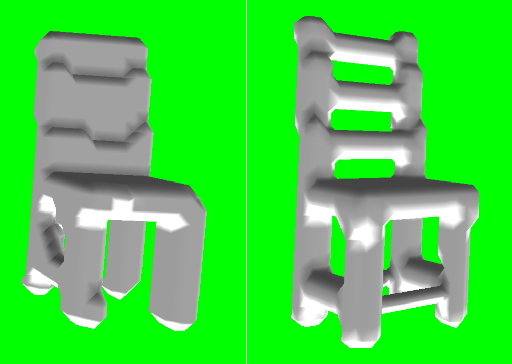

# PyTorch-Voxel-VAE

PyTorch implementation of [https://github.com/IsaacGuan/3D-VAE](https://github.com/IsaacGuan/3D-VAE) with some modifications.

<p style="text-align: center;">

Left: Reconstruction, Right: Ground truth
</p>

## Train
```
python3 train.py
```

## Test
```
python3 test.py
```

Results are saved to `./reconstructions/`